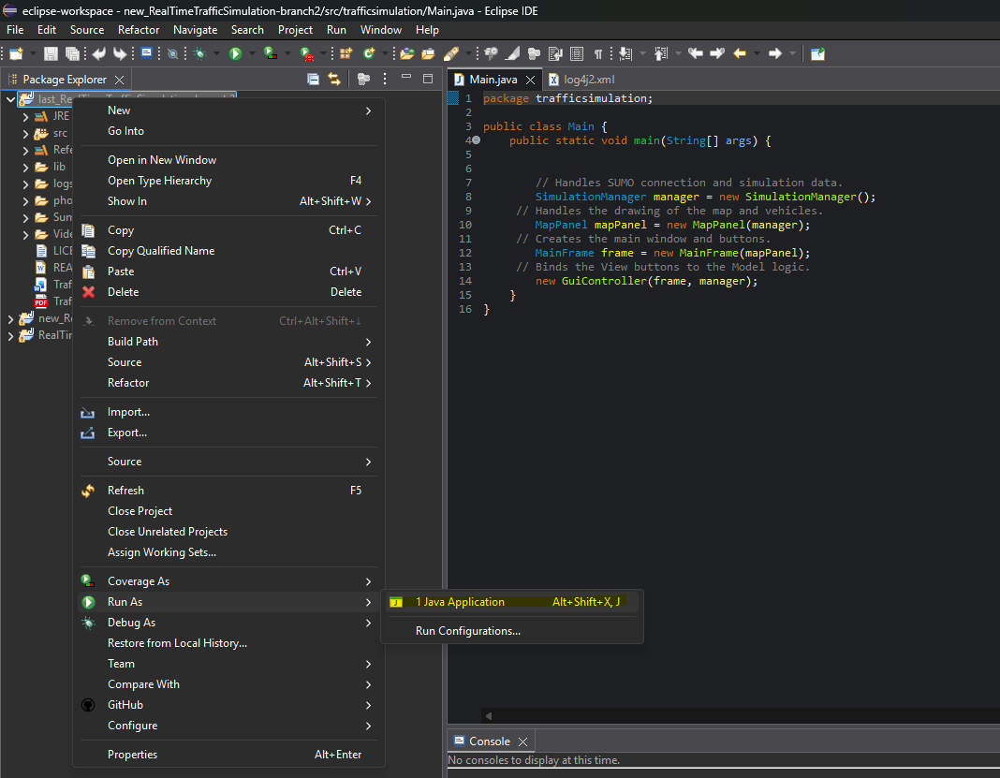
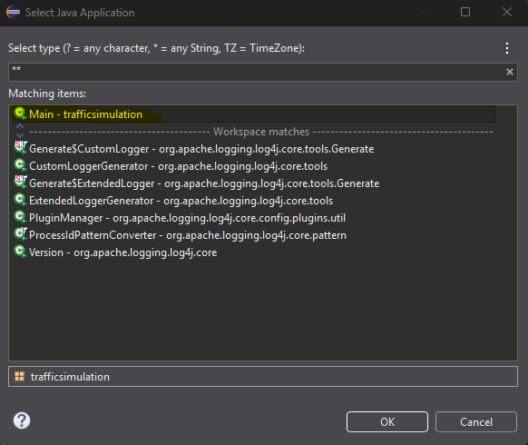
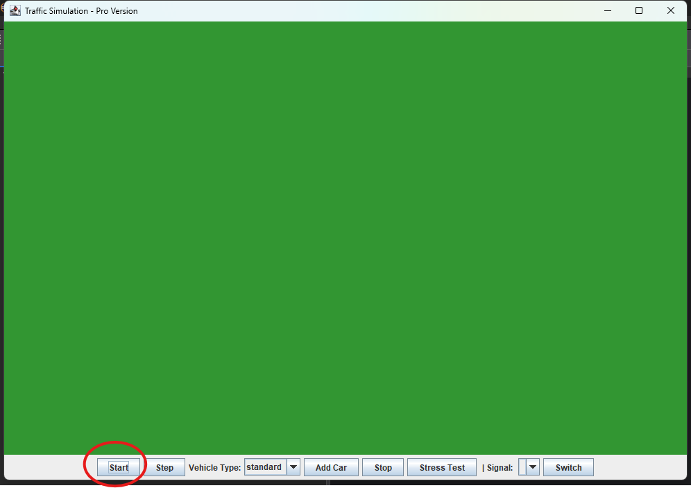
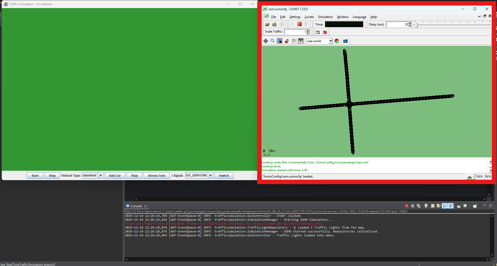
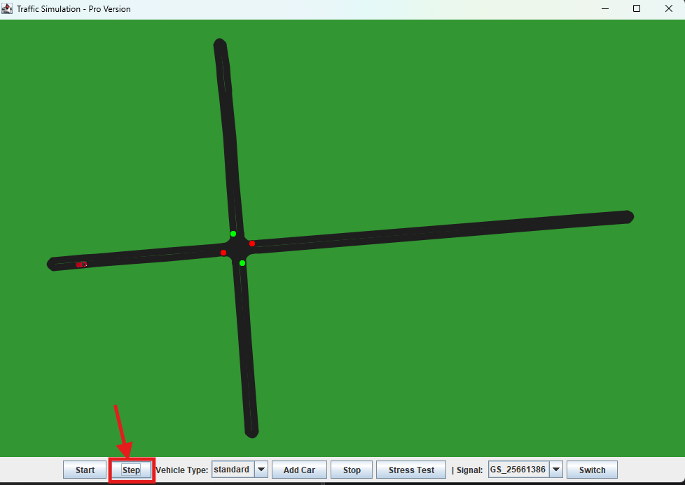
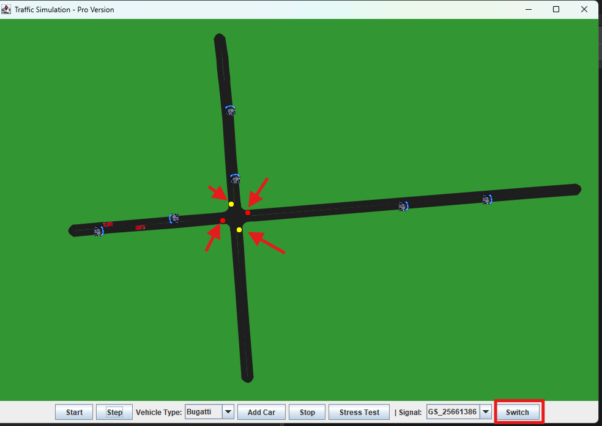
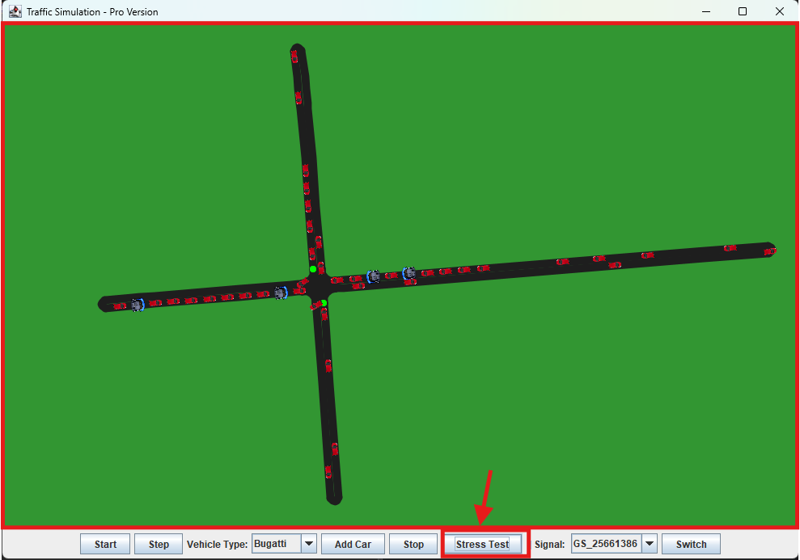
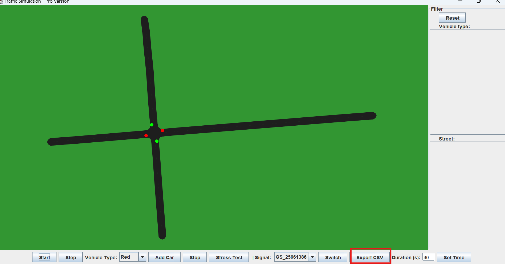
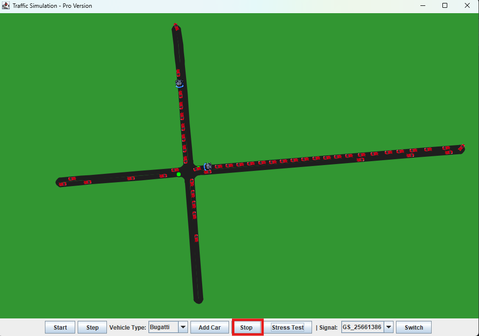
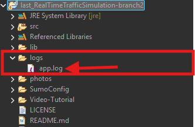

# 🚦 Traffic Simulation Manager - Pro Version

An interactive Traffic Simulation Control Panel based on **Java Swing**, **SUMO (Simulation of Urban MObility)**, and **TraCI4J**. This application allows real-time control over traffic lights, vehicle injection, and simulation stress testing.

## 🌟 Key Features

* **Real-time Visualization:** View the traffic map and vehicles moving in real-time.
* **Traffic Light Control:** Select any junction and manually switch phases (Green/Yellow/Red) safely using synchronized logic.
* **Vehicle Injection:** Add specific car types (Ferrari, Bugatti, F1, etc.) on demand.
* **Stress Testing:** One-click scenario to inject 100+ vehicles to test network capacity.
* **Robust Logging:** Uses **Log4j 2** for detailed simulation tracking and error handling.
* **Crash Prevention:** Implements smart phase switching (Modulo arithmetic) to prevent SUMO connection errors.

---

## 📸 Step-by-Step Walkthrough

> 🎥 **Watch the Demo:** A full video tutorial is available in the `Video-Tutorial/` folder.

Here is a complete demonstration of the application workflow:

### 1. Launching the Application
Right-click on the project and select **Run As > Java Application**.


### 2. Selecting the Main Class
Choose `Main - trafficsimulation` from the matching items list to start the program.


### 3. Starting the Server
Click the **Start** button to initialize the connection and launch SUMO.


### 4. SUMO running in Background
The SUMO GUI opens automatically in the background, ready for simulation.


### 5. Manual Control
Clicking the **Step** button advances the simulation time manually.


### 6. Adding Vehicles
Select a car type from the dropdown menu and click **Add Car** to spawn it.


### 7. Traffic Light Control
Select a junction and click **Switch** to change the traffic light color instantly.


### 8. Stress Testing
Click **Stress Test** to inject a heavy load of vehicles and test performance.


### 8. Export CSV File
Click **Export CSV** to download the CSV File to a folder of your choice.


### 9. Stopping the Simulation
Click the **Stop** button to close the connection and end the session safely.


### 10. Log Generation
The application automatically generates an `app.log` file recording all events.


---

## 📂 Project Structure

The project follows a standard Eclipse Java project structure, utilizing the **MVC (Model-View-Controller)** pattern for better code organization.

* **`src/trafficsimulation/`** _(Java Source Code)_
    * **Entry Point:**
        * `Main.java`: The main entry point that launches the application.
    * **Controller:**
        * `GuiController.java`: Bridges the View and Model; handles user inputs (buttons, clicks) and executes logic.
    * **View (GUI):**
        * `MainFrame.java`: The main application window and layout.
        * `MapPanel.java`: Responsible for rendering the map and simulation elements visually.
    * **Model & Logic:**
        * `SimulationManager.java`: Core engine that manages the connection with SUMO via TraCI.
    * **Data Repositories:**
        * `TrafficLightRepository.java`: Manages the collection of all traffic lights.
        * `VehicleRepository.java`: Manages vehicle injection and tracking.
    * **Wrappers (Objects):**
        * `TrafficLightWrap.java`: Represents a single traffic light logic (Phases, State).
        * `VehicleWrap.java`: Represents an individual vehicle within the simulation.

* **`SumoConfig/`** _(Simulation Environment)_
    * Contains the map and scenario files (`osm.sumocfg`, `osm.net.xml.gz`, `osm.passenger.trips.xml`) required by SUMO.

* **`Referenced Libraries/`**
    * **TraaS.jar:** The API used for Java-SUMO communication.
    * **Log4j 2:** Used for robust logging and error handling.

* **`Video-Tutorial/` & `Screenshots/`**
    * Documentation assets including a full video walkthrough and interface screenshots.

---

## 🛠️ Technologies Used

* **Programming Language:** Java 21 (Compatible with Java 8+)
* **GUI Framework:** Java Swing (JFrame, JPanel)
* **Simulation Engine:** [Eclipse SUMO](https://eclipse.dev/sumo/) (Simulation of Urban MObility)
* **Middleware:** TraCI4J / TraaS (Traffic Control Interface for Java)
* **Logging:** Apache Log4j 2 (for robust error tracking and event logging)
* **Architecture:** MVC (Model-View-Controller) Design Pattern

---

## 🚀 How to Run

### Prerequisites
1.  **Java JDK 8** or higher installed.
2.  **Eclipse SUMO** installed and added to your system's `PATH` variable (Crucial).
3.  An IDE like **Eclipse** or **IntelliJ IDEA**.

### Steps
1.  **Clone the Repository:**
    ```bash
    git clone [https://github.com/33meow/RealTimeTrafficSimulation.git](https://github.com/33meow/RealTimeTrafficSimulation.git)
    ```
2.  **Import to Eclipse:**
    * Open Eclipse -> File -> Open Projects from File System -> Select the project folder.
3.  **Verify Configuration:**
    * Ensure the `SumoConfig/` folder is present in the project root.
    * Ensure `TraaS.jar` and `Log4j` jars are correctly linked in "Referenced Libraries".
4.  **Launch:**
    * Navigate to `src/trafficsimulation/Main.java`.
    * Right-click -> **Run As** -> **Java Application**.

---

## 🎮 Controls Guide

| Button | Function |
| :--- | :--- |
| **Start** | Initializes the TraCI connection and launches the SUMO GUI in the background. |
| **Step** | Manually advances the simulation by one time-step (useful for precise observation). |
| **Add Car** | Injects a vehicle of the selected type (e.g., Ferrari, Bugatti) into the network. |
| **Switch 🚦** | Forces the selected Traffic Light to switch to its next phase safely (Green → Yellow → Red). |
| **Stress Test** | **(Pro Feature)** Injects 100 vehicles immediately and speeds up the simulation to test stability. |
| **Stop** | Safely closes the connection to SUMO and saves the logs. |
| **Export CSV** | Enables you to dowload the Log Data into a CSV File in a folder of your choosing. |

---

## 👥 Team Roles & Task Distribution

| Team Member | Project Mgmt & Docs | Primary Focus Area | Key Components & Classes Implemented |
| :--- | :---: | :--- | :--- |
| **Mabchour Salaheddine** | ✅ | **Vehicle System** | • `VehicleRepository` (Data Logic)<br>• `VehicleWrap` (Object Model) |
| **Ma Yiyuan** | ✅ | **Traffic Logic** | • `TrafficLightRepository`<br>• `TrafficLightWrap` (Phase Control) |
| **Gradwohl Laura** | ✅ | **UI Components** | • Progress Summary <br> • GUI Implementation<br> • Code Testing<br>• Status Monitoring Interface |
| **Mauricio de Souza Hilpert** | ✅ | **Core GUI & Testing** | • Main GUI Integration<br>• **Stress Test** Scenario & Logic |
| **Elias Heß** | ✅ | **Visualization** | • `MapPanel` (Rendering & Graphics)<br>• User Guide Draft |

## 📅 Time Plan & Roadmap

| Milestone | Deadline | Planned Features & Deliverables | Status |
| :--- | :--- | :--- | :---: |
| **Milestone 1** | **27.11.2025** | • System Architecture Design<br>• SUMO Connection Setup (TraaS)<br>• Basic Simulation Loop | ✅ **Done** |
| **Milestone 2** | **14.12.2025** | • **Interactive Map:** Real-time rendering (`MapPanel`)<br>• **Vehicle Injection:** Repository & Wrapper logic<br>• **Basic Control:** Start/Stop/Step buttons | ✅ **Done** |
| **Milestone 3** |**18.01.2026** | • **Traffic Light Control:** Phase switching (`TrafficLightWrap`)<br>• **Stress Testing:** High-load scenario implementation<br>• **Documentation:** User Guide & Progress Summary | ✅ **Implemented** |
| **Final Submission** | **18.01.2026** | • **Refinement:** Code Optimization & Final Bug Fixes<br>• **Final Deliverables:** Video Tutorial & Project Report<br>• **Presentation:** Preparing the final demo | ✅ **Done**  |

---

## 🙏 Acknowledgments
* Special thanks to **Prof. Dr.-Eng. Ghadi Mahmoudi** for the guidance and supervision throughout this project.
* Course: **Object-Oriented Programming in Java**.
